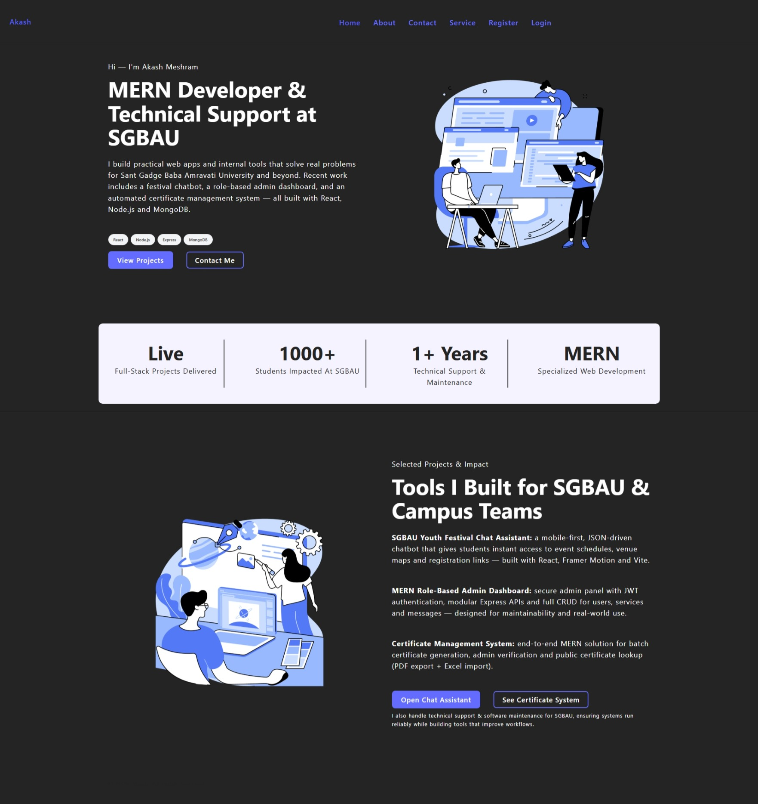
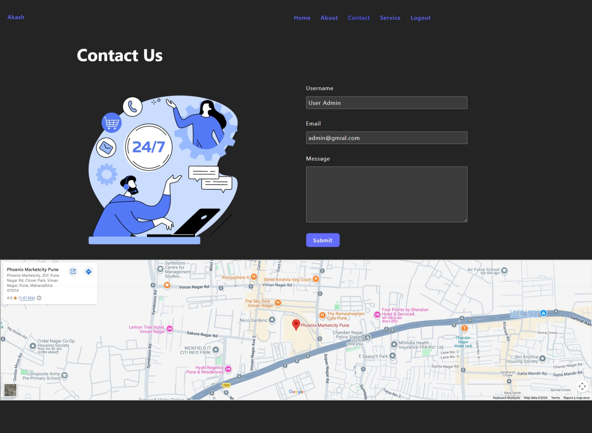
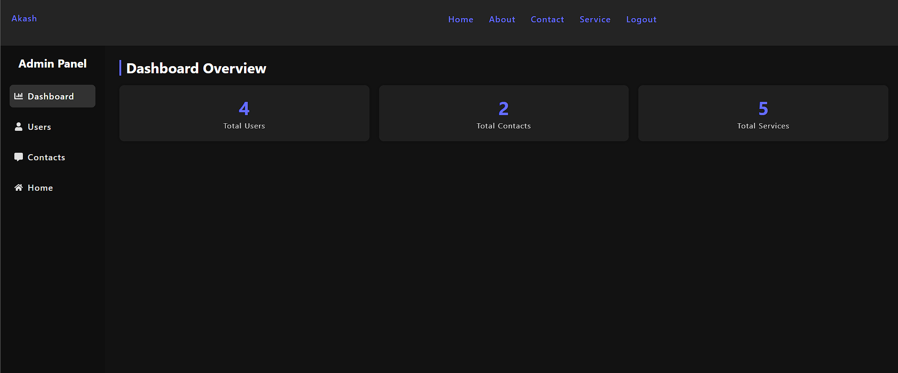
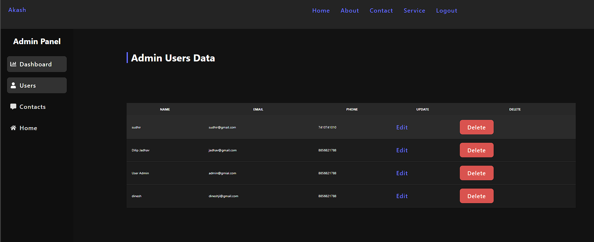

# MERN Portfolio and Admin Dashboard
## landing page


## contact page


## Admin Dashboard


## Admin - Users



This repository contains a full-stack MERN application that combines a personal portfolio website with a protected admin panel. Visitors can browse the site, learn about the developer, view services, register or log in, and submit contact messages. Admin users can access a secured dashboard to review platform stats, manage users, and delete contact submissions.

The project is built with React on the frontend and Node.js, Express, and MongoDB on the backend. It demonstrates authentication, role-based authorization, protected routes, REST APIs, and admin-side CRUD operations in one codebase.

## What the Project Includes

- Public pages for Home, About, Services, Contact, Register, and Login
- JWT-based authentication for user registration and login
- Role-based admin access using `isAdmin`
- Protected admin dashboard with summary cards
- Admin user management: list, edit, and delete users
- Admin contact management: list and delete contact messages
- Services fetched dynamically from MongoDB
- Backend request validation with Zod
- Password hashing with `bcryptjs`
- Global auth state in React Context
- Toast notifications for key actions

## Tech Stack

### Frontend

- React
- Vite
- React Router DOM
- React Toastify
- React Icons
- `jwt-decode`

### Backend

- Node.js
- Express
- MongoDB
- Mongoose
- JSON Web Tokens
- `bcryptjs`
- Zod

## How the App Works

### Public Site

The public side works like a portfolio website. Visitors can read about the developer, browse services, and send a message through the contact form. Service records are loaded from MongoDB and displayed on the frontend.

### Authentication

Users can register and log in from the frontend. On registration, the backend validates the request with Zod, hashes the password, stores the user in MongoDB, and returns a JWT token. On login, the backend verifies the credentials and returns a new token.

The frontend stores the token in `localStorage`, uses it to fetch the logged-in user, and redirects admin users into the admin area after login.

### Admin Area

The admin section is protected on both the frontend and backend:

- React route protection prevents non-admin users from accessing `/admin`
- Express auth middleware validates the JWT token
- Admin middleware checks `req.user.isAdmin`

Once authenticated as an admin, the user can:

- View dashboard counts for users, contacts, and services
- View all registered users
- Update user details
- Delete users
- View all contact form submissions
- Delete contact messages

## Project Structure

```text
MERN/
|-- client/
|   |-- public/
|   |-- src/
|   |   |-- components/
|   |   |-- layouts/
|   |   |-- pages/
|   |   `-- store/
|   |-- package.json
|   `-- vite.config.js
|-- server/
|   |-- Controllers/
|   |-- middlewares/
|   |-- models/
|   |-- Router/
|   |-- utils/
|   |-- validators/
|   |-- package.json
|   `-- server.js
`-- README.md
```

## Main API Routes

### Auth

- `GET /api/auth/` - basic test route
- `POST /api/auth/register` - create a new user
- `POST /api/auth/login` - log in and receive a JWT
- `GET /api/auth/user` - get current user data from token

### Contact

- `POST /api/form/contact` - submit a contact message

### Services

- `GET /api/data/service` - fetch all services

### Admin

- `GET /api/admin/users` - list all users
- `GET /api/admin/users/:id` - get one user
- `PATCH /api/admin/users/update/:id` - update a user
- `DELETE /api/admin/users/delete/:id` - delete a user
- `GET /api/admin/contacts` - list all contact messages
- `DELETE /api/admin/contact/delete/:id` - delete a contact message

## Environment Variables

Create a `server/.env` file with the following keys:

```env
MONGODB_URI=your_mongodb_connection_string
JWT_SECRET_KEY=your_secret_key
```

## Local Setup

### 1. Install dependencies

```bash
cd server
npm install

cd ../client
npm install
```

### 2. Start the backend

The backend currently does not define a `dev` script in `server/package.json`, so start it with one of these commands:

```bash
cd server
node server.js
```

or

```bash
cd server
npx nodemon server.js
```

The Express server runs on `http://localhost:5000`.

### 3. Start the frontend

```bash
cd client
npm run dev
```

The Vite frontend runs on `http://localhost:5173`.

## Admin Access Note

New users are created with `isAdmin: false` by default. To use the admin dashboard, promote a user in MongoDB by setting that user's `isAdmin` field to `true`, then log in again.

## Important Notes

- The frontend currently calls the backend using hardcoded URLs such as `http://localhost:5000`
- CORS in the backend is configured for `http://localhost:5173`
- There is no automated test suite configured yet

## Why This Project Matters

This project shows how to build a practical MERN application with both public and protected experiences in one codebase. It works well as a portfolio project, a learning reference for JWT auth and admin routing, and a starting point for service-based business or internal dashboard applications.
